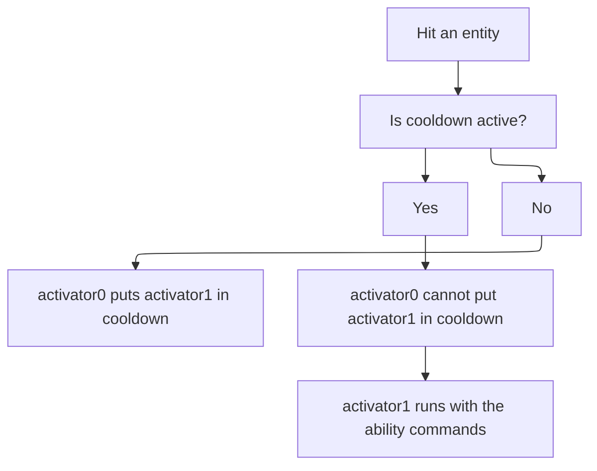

# Temporary Ability

This page teaches you how to utilize inbuilt activator cooldowns to make sure temporary ability durations are very reliable.  
  
For this tutorial, we will make a temporary ability where the user has to press right click to enable special effects for PLAYER_HIT_ENTITY.

:::info
If you have the `ei.nocd.*` or the `*` permission, this method will malfunction.
:::

## Flowchart:




## Steps:

### 1) Create an EI Item

### 2) Create a PLAYER_RIGHT_CLICK activator for now
  
We will come back to this later.
### 3) Create 2 PLAYER_HIT_ENTITY activators
  
  
  
:::info
We need to take note of the activator ids of the 2 PLAYER_HIT_ENTITY activators.
:::

### 4) Go to the PLAYER_RIGHT_CLICK activator we made earlier
That is where we will add the EICOOLDOWN command.

#### Add the EICOOLDOWN command
[Click here to visit the command's page](https://docs.splugins.net/tools-for-all-plugins-score/custom-commands/player-and-target-commands#eicooldown)

We will write the command like this:
```
EICOOLDOWN %player% %id% 60 false activator1
```
For the first 2 arguments, we wrote %player% and %id% for flexibility and to make sure the item does not break if you suddenly decided to rename the id of this item and for
good practice when creating bulk amounts of similar items.

For the third argument, that will be the duration of the temporary ability. As usual, it's not going to be strictly 60 seconds. You can adjust it however you want.

For the final/5th argument, this one is important because we have to properly tell the plugin what activator to disable to avoid complications.
The activator we are trying to put in a 60 second cooldown is an activator that will prevent the next one from running, the one responsible for executing
ability functions.

### 5) Note down the id of the 3rd/last activator
  

We need to know the id of the 3rd activator so we can put it in cooldown if the temporary ability isn't up yet.


### 6) Go to the 2nd activator and disable cooldown messages
  

You'd really wanna disable this option because it's going to spam a LOT depending on the situation

#### Add the EICOOLDOWN to this activator
```
EICOOLDOWN %player% %id% 1 true activator2
```
We just need 1 tick of cooldown to prevent activator2 from running.

### 7) Go to the 3rd activator and disable cooldown messages

This activator gets cooldowns too due to the second activator but for this one, feel free to set cooldowns on this activator on its activator editor to edit how frequent you can trigger this temporary ability.

If you want to display the cooldown of this temporary ability, create a copy of this activator and use EICOOLDOWN to put the other activator in cooldown with the same cooldown as this one, and write the cooldown message in that other activator.

<hr/>

Now everything is set up properly! You just have to add commands to the 3rd activator to setup the temporary ability's effects.

### Sample Item Config:

<details>
<summary>Click to expand</summary>

```yml
# The name or display name
name: '&eDefault name'
# The lore of the item
lore:
- '&b&oDefault lore'
# The material
material: DIAMOND_SHOVEL
# Item Glowing effect
glow: false
# Disable the enchant glide effect
disableEnchantGlide: false
# Disable item stacking ?
disableStack: false
# Keep the item on death ?
keepItemOnDeath: false
# Can be used only by the owner
# ⚠ Require Store item info on true
canBeUsedOnlyByTheOwner: false
# Cancel event if not owner
cancelEventIfNotOwner: false
# BlackListed Activators
# (can be used by everyone even if
# the only owner feature is set to true)
onlyOwnerBlackListedActivators: []
# Store item info ?
# Store the item info like the owner
storeItemInfo: false
# Item unbreakable ?
unbreakable: false
# The durability feature
# will be ignored, and the usage
# feature will be used as durability
isDurabilityBasedOnUsage: false
# Cancel the event if the player has no permission
cancelEventIfNoPermission: false
# The whitelisted worlds features
whitelistedWorlds: []
# The glider
glider: false
# Keep the default attributes
# Only for 1.19+
keepDefaultAttributes: true
# For new item LET IT FALSE PLS
# Otherwise you can let it true
# if you want to update your old items turn it FALSE
# But be careful the item tags may change
# it can impact shopkeeper or custom craft recipe
# Only for 1.19+
ignoreKeepDefaultAttributesFeature: false
config_5: true
config_update: true
# The usage features
# Increase or Decrease this usage with
# UsageModification in your activators
usageFeatures:
  # The usage of the item
  # -1 = Infinite
  # Increase or Decrease this usage with
  # UsageModification in your activators
  usage: 1
  # Is refreshable clean
  isRefreshableClean: true
  # The usage limit of the item
  # Usage can't be increased above this value
  usageLimit: -1
# The drop features
dropFeatures:
  # Glow drop
  glowDrop: false
  # The color of the glow
  glowDropColor: WHITE
  # Display custom name above the item
  displayNameDrop: false
# The enchantments of the item
enchantments: {}
# The hiders features
# Hiders to hide:
# Attributes, Enchants, ...
hiders:
  # Hide enchantments
  hideEnchantments: false
  # Hide unbreakable
  hideUnbreakable: false
  # Hide attributes
  hideAttributes: false
  # Hide usage
  hideUsage: false
  # Hide destroys
  hideDestroys: false
  # Hide placed on
  hidePlacedOn: false
  # Hide dye
  hideDye: false
  # Hides armor trim details in
  # armor. Does not hide armor
  # trim item details
  hideArmorTrim: false
  # Hide additional tooltip
  # This option can no longer hide
  # armor trim item details in 1.21.5+
  hideAdditionalTooltip: false
  # Hide tool tip
  hideToolTip: false
# The give first join features
giveFirstJoinFeatures:
  # Enable the feature
  giveFirstJoin: false
  # The amount to give
  giveFirstJoinAmount: 1
  # Slot between 0 and 8 includes
  giveFirstJoinSlot: 0
# The restrictions features
restrictions:
  # The item can't be
  # moved of the inventory
  locked-in-inventory: false
# The variables
# Variables are used to store data like kills / deaths ...
variables: {}
# The activators / triggers
activators:
  activator0:
    # The name or display name
    name: '&eActivator'
    option: PLAYER_RIGHT_CLICK
    typeTarget: NO_TYPE_TARGET
    # Usage modification
    usageModification: 0
    # Cancel the vanilla event
    cancelEvent: false
    # If another plugin cancels the event that
    # triggers the activator and you enabled this feature
    # the activator will not be activated
    noActivatorRunIfTheEventIsCancelled: false
    # Automatically update the item
    autoUpdateItem: false
    # The cooldown
    cooldownFeatures:
      # The cooldown
      cooldown: 0
      # The placeholders conditions to pause the cooldown
      pausePlaceholdersConditions: {}
    # The global cooldown
    # (For ALL players and entities)
    globalCooldownFeatures:
      # The cooldown
      cooldown: 0
    # To add cooldown
    # to another EI
    otherEICooldowns: {}
    # The required items
    requiredItems: {}
    # The required executable items
    requiredExecutableItems: {}
    # The required Magics
    # (from EcoSkills)
    requiredMagics: {}
    # The slots where the
    # activator will work
    detailedSlots:
    - -1
    playerCommands:
    - EICOOLDOWN %player% %id% 60 false activator1
    - SENDMESSAGE &e&lTHOR ACTIVATE!
    # Add player conditions to determine
    # when the 
    playerConditions: {}
    #
    worldConditions: {}
    #
    itemConditions: {}
    #
    customConditions: {}
    # The placeholders conditions
    placeholdersConditions: {}
    # Part to modifiy your variables
    variablesModification: {}
  activator1:
    # The name or display name
    name: '&eActivator'
    option: PLAYER_HIT_ENTITY
    # Usage modification
    usageModification: 0
    # Cancel the vanilla event
    cancelEvent: false
    # If another plugin cancels the event that
    # triggers the activator and you enabled this feature
    # the activator will not be activated
    noActivatorRunIfTheEventIsCancelled: false
    # Automatically update the item
    autoUpdateItem: false
    # The cooldown
    cooldownFeatures:
      # The cooldown
      cooldown: 0
      # Display the cooldown message
      displayCooldownMessage: false
      # The placeholders conditions to pause the cooldown
      pausePlaceholdersConditions: {}
    # The global cooldown
    # (For ALL players and entities)
    globalCooldownFeatures:
      # The cooldown
      cooldown: 0
    # To add cooldown
    # to another EI
    otherEICooldowns: {}
    # The required items
    requiredItems: {}
    # The required executable items
    requiredExecutableItems: {}
    # The required Magics
    # (from EcoSkills)
    requiredMagics: {}
    # The slots where the
    # activator will work
    detailedSlots:
    - -1
    playerCommands:
    - EICOOLDOWN %player% %id% 1 true activator2
    # Add player conditions to determine
    # when the 
    playerConditions: {}
    #
    worldConditions: {}
    #
    itemConditions: {}
    #
    customConditions: {}
    # The placeholders conditions
    placeholdersConditions: {}
    # Specify a list of damageCauses that
    # can be affected
    # empty = all causes
    detailedDamageCauses: []
    detailedEntities: []
    entityCommands: []
    #
    entityConditions: {}
    # Part to modifiy your variables
    variablesModification: {}
  activator2:
    # The name or display name
    name: '&eActivator'
    option: PLAYER_HIT_ENTITY
    # Usage modification
    usageModification: 0
    # Cancel the vanilla event
    cancelEvent: false
    # If another plugin cancels the event that
    # triggers the activator and you enabled this feature
    # the activator will not be activated
    noActivatorRunIfTheEventIsCancelled: false
    # Automatically update the item
    autoUpdateItem: false
    # The cooldown
    cooldownFeatures:
      # The cooldown
      cooldown: 0
      # Display the cooldown message
      displayCooldownMessage: false
      # The placeholders conditions to pause the cooldown
      pausePlaceholdersConditions: {}
    # The global cooldown
    # (For ALL players and entities)
    globalCooldownFeatures:
      # The cooldown
      cooldown: 0
    # To add cooldown
    # to another EI
    otherEICooldowns: {}
    # The required items
    requiredItems: {}
    # The required executable items
    requiredExecutableItems: {}
    # The required Magics
    # (from EcoSkills)
    requiredMagics: {}
    # The slots where the
    # activator will work
    detailedSlots:
    - -1
    playerCommands: []
    # Add player conditions to determine
    # when the 
    playerConditions: {}
    #
    worldConditions: {}
    #
    itemConditions: {}
    #
    customConditions: {}
    # The placeholders conditions
    placeholdersConditions: {}
    # Specify a list of damageCauses that
    # can be affected
    # empty = all causes
    detailedDamageCauses: []
    detailedEntities: []
    entityCommands:
    - execute at %entity_uuid% run summon lightning_bolt
    #
    entityConditions: {}
    # Part to modifiy your variables
    variablesModification: {}
# Display conditions in the lore
displayConditions:
  # Add player conditions to determine
  # when the 
  playerConditions: {}
  #
  worldConditions: {}
  #
  itemConditions: {}
  # The placeholders conditions
  placeholdersConditions: {}
  # Enable or disable this feature
  enableFeature: false
# Food features
foodFeatures:
  # Is the food meat?
  isMeat: false
  # The nutrition of the food
  nutrition: 1
  # The saturation of the food
  saturation: 1
  # Can the player always eat this food?
  canAlwaysEat: false
# Consumable Features
consumableFeatures:
  # Enable this features
  enable: false
  # The animation
  animation: EAT
  # Has consume particles
  hasConsumeParticles: false
  # The consume seconds
  consumeSeconds: 3
# The weapon features
weaponFeatures:
  # Enable this features
  enable: true
  # The amount of time the target's
  # shield will not work in seconds
  disableBlockingTime: 0
  # The amount of durability reduced per attack
  damagePerAttack: 2
# The block attacks features
blockAttacksFeatures:
  # Enable this features
  enable: false
  # The block delay in seconds
  blockDelay: 0
  disableCooldownScale: 1.0
  # The damage reductions
  damageReductions: {}
# The rarity of the item
itemRarity:
  # Enable or disable the rarity feature
  enableRarity: false
  # The rarity of the item
  rarity: COMMON
# The repairable features
repairableFeatures:
  # Enable this features
  enable: false
  # The repair cost
  repairCost: 2
# The equippable features
equippableFeatures:
  # Enable this features
  enable: false
  # The slot
  slot: BODY
  # Enable the sound
  enableSound: false
  # The sound
  sound: ITEM.ARMOR.EQUIP_DIAMOND
  # The item will take damage when the player is hurt
  damageableOnHurt: false
  # The item can be dispensed
  dispensable: true
  # The item can be swapped
  swappable: true
  # The allowed entities
  allowedEntities:
  - PLAYER
# The attributes
attributes: {}
```
</details>

If you have any more concerns, go to the discord server
